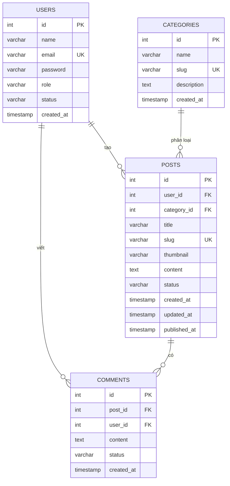

# ERD cá nhân – Khổng Thị Lý

## Chức năng phụ trách

- Quản lý bình luận
- Quản lý danh mục
- Impact Box

## Sơ đồ ERD

## Mối quan hệ

### Users – Posts

Một người dùng có thể tạo nhiều bài viết.

**Khóa liên kết:** `posts.user_id → users.id`

### Users – Comments

Một người dùng có thể viết nhiều bình luận.

**Khóa liên kết:** `comments.user_id → users.id`

### Categories – Posts

Một danh mục có thể chứa nhiều bài viết.

**Khóa liên kết:** `posts.category_id → categories.id`

### Posts – Comments

Một bài viết có thể có nhiều bình luận.

**Khóa liên kết:** `comments.post_id → posts.id`

## Các bảng liên quan đến chức năng cá nhân

### Quản lý bình luận

Chức năng quản lý bình luận sử dụng:

- `comments`: lưu nội dung và trạng thái bình luận.
- `users`: xác định người viết bình luận.
- `posts`: xác định bài viết được bình luận.

### Quản lý danh mục

Chức năng quản lý danh mục sử dụng:

- `categories`: lưu thông tin danh mục.
- `posts`: xác định các bài viết thuộc danh mục.

### Impact Box

Impact Box liên quan đến việc người dùng lưu và quản lý các bài viết mà họ quan tâm.