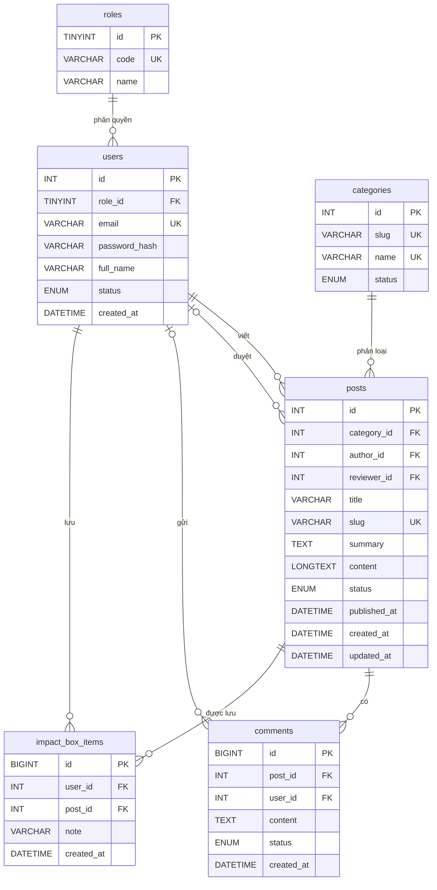

# ERD nhóm - Website tin tức/blog Nhịp Khoa

## Ràng buộc chính

- Email người dùng, mã vai trò, tên/slug danh mục và slug bài viết là duy nhất.
- Mỗi bài viết phải thuộc một danh mục và một tác giả đã tồn tại.
- Một người chỉ lưu một bài viết vào Impact Box một lần nhờ
  `UNIQUE(user_id, post_id)`.
- Người duyệt bài và người gửi bình luận có thể là `NULL` khi chưa duyệt hoặc
  khi hỗ trợ bình luận khách.

## Dữ liệu không lưu dư thừa

- Không lưu tên tác giả và tên danh mục trực tiếp trong `posts`; lấy bằng `JOIN`.
- Không lưu tổng số bình luận; dùng `COUNT(comments.id)` khi cần thống kê.
- Không lưu trạng thái “đã lưu” trong `posts`; xác định từ `impact_box_items`.
