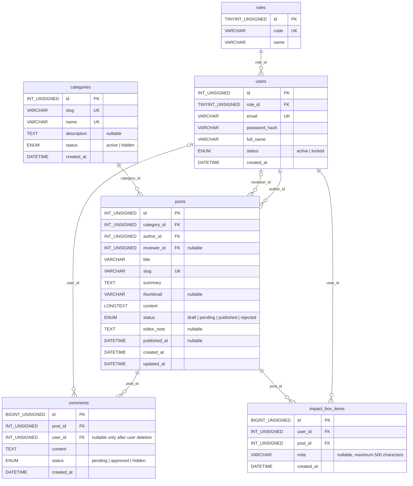

# ERD nhóm - Website tin tức/blog Nhịp Khoa

Tài liệu này mô tả đúng cấu trúc hiện tại trong `database/schema.sql`. Hệ thống
gồm sáu bảng và không có bảng hoặc cột riêng cho bình luận của khách.

## Ý nghĩa quan hệ

- Một vai trò có nhiều người dùng; mỗi người dùng thuộc đúng một vai trò.
- Một người dùng có thể viết nhiều bài; mỗi bài có đúng một tác giả.
- Một người dùng có thể duyệt nhiều bài; bài chưa được duyệt có
  `reviewer_id = NULL`.
- Một danh mục có nhiều bài; mỗi bài thuộc đúng một danh mục.
- Một bài có nhiều bình luận. Chỉ tài khoản đang đăng nhập và còn hoạt động mới
  được tạo bình luận; bình luận mới luôn có trạng thái `pending`.
- `impact_box_items` là bảng nối quan hệ nhiều-nhiều giữa người dùng và bài viết.

## Khóa duy nhất và chỉ mục

- `roles.code`, `users.email`, `categories.slug`, `categories.name` và
  `posts.slug` là duy nhất.
- `UNIQUE(user_id, post_id)` trong `impact_box_items` ngăn một người lưu cùng
  một bài nhiều lần.
- `posts(status, published_at)`, `posts(category_id)` và
  `comments(post_id, status)` được đánh chỉ mục cho các truy vấn công khai và
  kiểm duyệt.

## Quy tắc khóa ngoại

| Bảng/cột | Tham chiếu | Khi bản ghi cha bị xóa |
|---|---|---|
| `users.role_id` | `roles.id` | `RESTRICT` |
| `posts.category_id` | `categories.id` | `RESTRICT` |
| `posts.author_id` | `users.id` | `RESTRICT` |
| `posts.reviewer_id` | `users.id` | `SET NULL` |
| `comments.post_id` | `posts.id` | `CASCADE` |
| `comments.user_id` | `users.id` | `SET NULL` |
| `impact_box_items.user_id` | `users.id` | `CASCADE` |
| `impact_box_items.post_id` | `posts.id` | `CASCADE` |

`comments.user_id` cho phép `NULL` để giữ lại nội dung khi tài khoản bị xóa,
không phải để hỗ trợ khách bình luận.

## Vòng đời dữ liệu chính

- Bài viết: `draft` → `pending` → `published` hoặc `rejected`.
- Bình luận: tạo mới ở `pending`, sau đó Admin chuyển thành `approved` hoặc
  `hidden`; chỉ bình luận `approved` được hiển thị công khai.
- Trang công khai chỉ đọc bài `published` thuộc danh mục `active`.

## Dữ liệu không lưu dư thừa

- Tên tác giả và tên danh mục được lấy bằng `JOIN`, không lặp lại trong `posts`.
- Tổng số bình luận được tính bằng `COUNT`, không lưu thành một cột riêng.
- Trạng thái “đã lưu” được xác định từ `impact_box_items`, không lưu trong
  `posts`.
